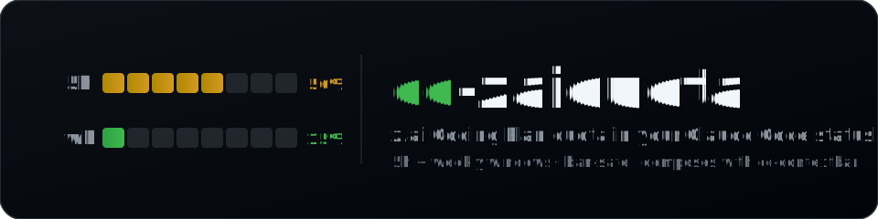
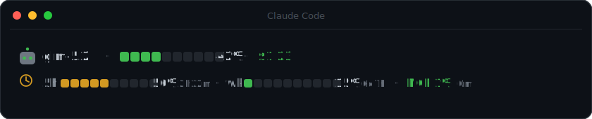

<p align="center">
  
</p>

<p align="center">
  <a href="https://github.com/evggzzz/cc-zaiquota/releases"></a>
  
  
  
  
  
</p>

# z.ai の制限、引っかかる前にわかる。

[Claude Code](https://code.claude.com) のステータスラインに常時表示される、z.ai GLM Coding Plan 向けの**クォータメーター**。5時間・週次・MCPの各ウィンドウを、カラーバーとリセットまでのカウントダウン付きで可視化します。

<p align="center">
  <sub><a href="README.md">English</a> · <a href="README.zh-CN.md">简体中文</a> · <a href="README.ja.md">日本語</a></sub>
</p>

<p align="center">
  
</p>

---

## ✨ 機能

| | |
|---|---|
| ⏳ **3つのウィンドウを一目で** | 5時間ローリング・週次（7日）・MCP月次を、それぞれカラーバー＋％＋リセットまでの時間で表示します。 |
| 🎨 **リッチかつコンパクト** | カラーのバッテリーバー＋太字の％＋薄い色のカウントダウン。デフォルトは2幅emojiなし（ワイド端末なら `ZAI_ICONS=1` で表示）。 |
| 🧩 **cc-contextbar と合成** | [cc-contextbar](https://github.com/evggzzz/cc-contextbar) の下に重ねて2行ステータスラインに。単体でも使えます。 |
| 🛡️ **BAN回避設計** | ステータスラインはキャッシュ読込のみで**描画ごとの通信ゼロ**。更新はオンデマンドで、z.ai公式と**同一のリクエスト**を使います。 |
| ⚡ **AIエージェント不要** | 公式 `glm-plan-usage` プラグインと違い、更新はシェル1呼び出し（ミリ秒、約20秒ではありません）。 |

## 😤 問題

z.ai はウィンドウを使い切った瞬間に制限をかけます。しかも、まったく見えないまま次々に作業してしまう――なぜなら：

- Claude Code の**標準メーターは z.ai だと永遠に `0`** のまま（あのフィールドは Claude.ai 専用）。
- **公式** `glm-plan-usage` プラグインは動くが、確認のたびにAIエージェントを起動して**約20秒**かかる。

**cc-zaiquota は同じデータを一瞬で、常時、BAN安全に表示します。**

## 📊 他との比較

| | 標準 | 公式プラグイン | **cc-zaiquota** |
|---|:--:|:--:|:--:|
| z.aiクォータ表示 | ❌ ずっと `0` | ✅ | ✅ |
| 常時表示 | ❌ | ❌ オンデマンド | ✅ |
| 取得の速さ | — | 約20秒（AI経由） | **ミリ秒（シェル）** |
| 自動更新 | — | ❌ | ✅ |
| BAN安全 | — | ✅ 公式 | ✅ 同一リクエスト |

## 🛡️ BANを回避する仕組み

- ステータスラインは**ネットワーク通信を一切しない**。`~/.claude/zaiquota/quota.cache` を読むだけです。
- `/cc-zaiquota:refresh` は z.ai 公式 `glm-plan-usage` と**同一のリクエスト**（`GET {baseDomain}/api/monitor/usage/quota/limit`、`Authorization: $ANTHROPIC_AUTH_TOKEN`）。エンドポイントもヘッダも同じなので、公式ツールと区別がつきません。
- デフォルトはオンデマンドのみ（ポーリングループなし）。

## ♻️ 自動更新

`Stop` と `SessionStart` フック経由でキャッシュを自動更新します。毎ターン終了時とセッション開始時に走り、**`ZAI_REFRESH_MIN`（デフォルト600秒）に1回までスロットル**されます。使っている間は最新を保ち、アイドル中はポーリングしません。

- 間隔を調整: `~/.claude/zaiquota/config.env` に `ZAI_REFRESH_MIN=300`
- 即時更新: `/cc-zaiquota:refresh`（`--force` でスロットルを無視）

ステータスライン本体は**通信ゼロ**のまま。スロットル付きのフェッチャだけがAPIを叩きます。

## 🚀 インストール

> 環境変数 `ANTHROPIC_BASE_URL`＋`ANTHROPIC_AUTH_TOKEN`（公式プラグインと同じ）と [`jq`](https://stedolan.github.io/jq/) が必要です。

**A — プラグインで**

```bash
claude plugin marketplace add evggzzz/cc-zaiquota
claude plugin install cc-zaiquota@cc-zaiquota
```

そのあと Claude Code 上で：

```
/cc-zaiquota:refresh
```

**B — 1行で**

```bash
curl -fsSL https://raw.githubusercontent.com/evggzzz/cc-zaiquota/main/scripts/install.sh | bash
```

どちらもスクリプトを `~/.claude/zaiquota/` に置き、`~/.claude/statusline-compose.sh` を生成して `statusLine` をそこに向けます（事前に `.bak` でバックアップ）。**Claude Code を再起動**し、`/cc-zaiquota:refresh` でキャッシュを取得してください。

## 🔬 仕組み

- `quota-fetch.sh` → `GET /api/monitor/usage/quota/limit` を叩き、`.data`＋タイムスタンプをキャッシュに保存。
- `quota.sh` → `data.limits[]` を解析。2つの `TOKENS_LIMIT` は 5h（`nextResetTime` が早い方）と週次（遅い方）、`TIME_LIMIT` は MCP月次。リセットまでの時間は絶対時刻 `nextResetTime` から毎回リアルタイムで計算します。
- `compose.sh` → cc-contextbar（1行目）と本ウィジェット（2行目）を順に実行。これを `statusLine` に設定します。

## ⚙️ カスタマイズ

`~/.claude/zaiquota/config.env` を作ってデフォルトを上書きできます：

| 変数 | デフォルト | 効果 |
|---|---|---|
| `ZAI_SEGMENTS` | `10` | バーのセル数 |
| `ZAI_FILL` / `ZAI_EMPTY` | `█` / `░` | バーの文字 |
| `ZAI_ICONS` | `0` | `1` でemojiアイコンを表示（ワイド端末向け） |
| `ZAI_REFRESH_MIN` | `600` | 自動更新の最小間隔（秒） |

```bash
# ~/.claude/zaiquota/config.env
ZAI_SEGMENTS=8
ZAI_ICONS=1
ZAI_REFRESH_MIN=300
```

## 🗑️ アンインストール

```bash
curl -fsSL https://raw.githubusercontent.com/evggzzz/cc-zaiquota/main/scripts/install.sh | bash -s -- --uninstall
```

`statusLine` を cc-contextbar に戻し（存在すれば）、`~/.claude/zaiquota/` を削除します。

---

> ⭐ **z.ai の制限に作業中を止められたことがある人 ―― これ、あなたのためです。**

## ⭐ Star History

<a href="https://star-history.com/#evggzzz/cc-zaiquota&Date">
  
</a>

## 📄 ライセンス

MIT © [evggzzz](https://github.com/evggzzz)
